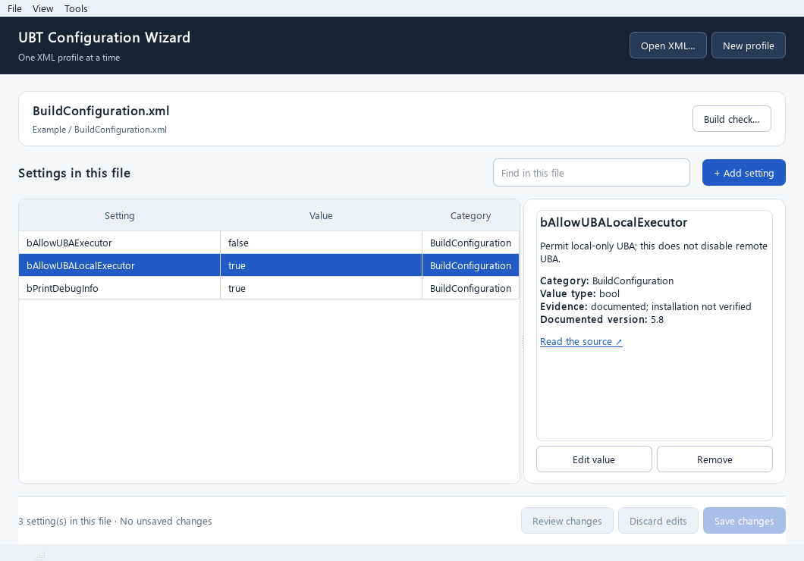

# UE5 UBT Configuration Wizard

A local desktop editor for UnrealBuildTool's `BuildConfiguration.xml` on Windows, macOS and Linux. Open one file, change settings, review the XML diff and save with a backup.



[Night mode preview](docs/night-mode.png)

## Use it

For a portable release, download the archive for your operating system from [Releases](https://github.com/Dimos082/ue5-ubt-config-wizard/releases), extract the **whole folder**, then run the application. These builds are unsigned.

To run from source with Python 3.12 or 3.13, use PowerShell on Windows:

```powershell
py -3.13 -m venv .venv
.\.venv\Scripts\python.exe -m pip install -c requirements-dev.lock .
.\.venv\Scripts\python.exe -m ue5_ubt_config_wizard
```

On macOS or Linux:

```bash
python3 -m venv .venv
.venv/bin/python -m pip install -c requirements-dev.lock .
.venv/bin/python -m ue5_ubt_config_wizard
```

1. Open a suggested XML file, browse to another, or create a new profile.
2. Select a setting to read its description and source. Double-click to edit, or use **+ Add setting** to search all catalog entries.
3. Click **Review changes**, then **Save changes**. An existing file is backed up before replacement.

Use **File** for Save a copy, Backup and Restore; **View → Night mode** for the dark theme; and **Tools** for optional engine/project selection and a local build check. The build-check command field is always editable and runs only when you click **Run command**.

## Catalog and limits

The bundled catalog contains 551 category/name candidates from [Epic's UE 5.8 Build Configuration page](https://dev.epicgames.com/documentation/unreal-engine/build-configuration-for-unreal-engine). It includes 139 reviewed explanations, of which 20 also have reviewed scalar value types. The other 412 candidates remain clearly marked as needing review. Settings without a confirmed type can be entered as **unverified raw text**; support and valid values depend on your engine version. A matching local schema can catch some invalid XML, but a successful build does not prove which profile UnrealBuildTool used. Unknown XML content is preserved. The app does not need Internet access to edit a profile.

## Test and publish

```bash
python -m pip install -c requirements-dev.lock -e ".[dev]"
python -m ruff check .
python -m ruff format --check .
python -m pytest
```

[CI](https://github.com/Dimos082/ue5-ubt-config-wizard/actions/workflows/ci.yml) tests pushes and pull requests on Windows, macOS and Linux. See [manual GitHub setup](docs/manual-github-setup.md) and [release instructions](docs/releasing.md) for owner-run commands. The project uses the proposed [Apache-2.0 license](LICENSE); review it before public distribution.
