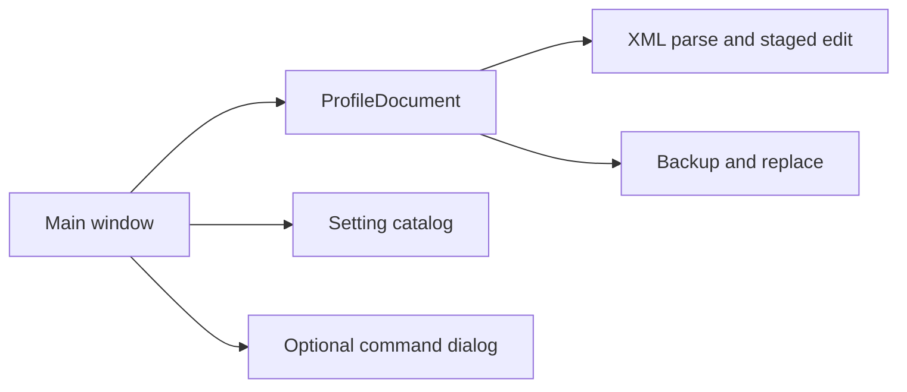

# Architecture

The application has one everyday workflow: **open a file → edit settings → review → save**. The main window shows only the selected file, its settings, the description of the selected row and the Save action. The large catalog appears when adding a setting. Engine selection, backup/restore and the optional command runner live in menus or separate dialogs.

`ui.py` handles the main window and short add/edit/review dialogs. `theme.py` provides explicit light/night palettes and selection/menu colors. `command_dialog.py` owns the optional local process and always presents an editable command field. `profile.py` is independent of Qt and owns XML parsing, preservation, conflict checks, backups and saving. `catalog.py` reads bundled documentation evidence and optional local schema information. `discovery.py` lists likely paths without deciding which profile UnrealBuildTool actually consumes. `runner.py` builds a suggested command and cancels only its own process tree.

No file changes on open, selection or editing. Changes stay in memory until Save. The Save dialog shows the exact destination and serialized diff; a matching local schema blocks invalid output, and an existing file receives a verified backup before replacement. No-op Save does not write. A single XML file cannot reveal inherited settings or all UnrealBuildTool defaults.

The catalog distinguishes documented names from confirmed support for a particular engine. All documented candidates appear in Add. Unreviewed settings use raw text with a visible warning; the app does not infer a type or guarantee that the engine accepts the value. The selected engine's schema, if available, adds structural evidence; it does not establish all runtime behavior. The optional build check is explicit and does not prove which profile was consumed.

The owner creates, commits and pushes the repository. Local tests use synthetic profiles; real-engine acceptance remains an owner-run integration step.
